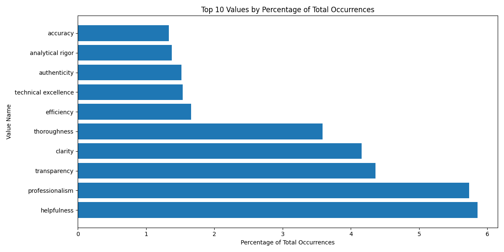

# Initial Analysis: Values-in-the-Wild Dataset

This document summarizes the initial analysis of Anthropic's Values-in-the-Wild dataset, showing the most frequent values and their distribution across different levels of the hierarchy.

## Top Values by Frequency

Based on the analysis of the values_frequencies.csv data, the following values appear most frequently:

1. helpfulness (5.86%)
2. professionalism (5.73%)
3. transparency (4.36%)
4. clarity (4.16%)
5. thoroughness (3.59%)
6. efficiency (1.66%)
7. technical excellence (1.54%)
8. authenticity (1.52%)
9. analytical rigor (1.37%)
10. accuracy (1.33%)

## Value Hierarchy Analysis

The values are organized in a hierarchical structure with levels 0-3, where:
- Level 0: Most specific values
- Level 3: Highest-level categories

### Distribution by Level

After analyzing the database, we found the following distribution:

| Level | Count | % of Total | Avg % Occurrence | Max % Occurrence |
|-------|-------|------------|-----------------|-----------------|
| 0     | 13231 | 399.74%    | 0.0302%         | 5.86%           |

### Top Categories

The top-level value categories (from previous research) are:
1. Practical Values (31.4%)
2. Epistemic Values (22.2%)
3. Social Values (21.4%)
4. Protective Values (13.9%)
5. Personal Values (11.1%)

## Data Storage

The data is stored in:
1. CSV files:
   - values_tree.csv: The hierarchical structure of values
   - values_frequencies.csv: Occurrence frequency data
   - filtered_values.csv: Filtered dataset excluding AI-specific values

2. SQLite database (values.db) with the following views:
   - values_typed: Main table with proper data types
   - top_values_typed: Top 20% values by occurrence
   - values_by_level: Summary statistics by hierarchy level
   - top_values_level_X: Top 20 values for each level X

## Analysis Scripts

The repository includes several scripts for data analysis:
- scripts/top_20.py: Identifies top 20% values by frequency
- scripts/plot_top_10.py: Generates visual charts of top values
- scripts/db_analysis.py: Provides statistical analysis of value distribution
- scripts/fix_db.py: Creates properly typed views for easier analysis

## Next Steps

1. Clustering analysis to identify value co-occurrence patterns
2. Network analysis showing relationships between values
3. Comparative analysis of values across different domains
4. Visualization of the full value hierarchy
5. Interactive dashboard for exploring the values data

## References

- Anthropic. (2025). Values in the Wild: Discovering and Analyzing Values in Real-World Language Model Interactions. [Anthropic Research](https://www.anthropic.com/research/values-wild)
- Huang, S., et al. (2025). Values in the Wild: Discovering and Analyzing Values in Real-World Language Model Interactions. [Research Paper](https://assets.anthropic.com/m/18d20cca3cde3503/original/Values-in-the-Wild-Paper.pdf)