# AI Values Taxonomy

This diagram shows the hierarchical structure of AI values taxonomy.

- **Level 3 (Green)**: Top-level value categories
- **Level 2 (Blue)**: Mid-level value categories
- **Level 1 (Orange)**: Specific values (showing a selection)

```mermaid
graph TD
  %% AI Values Taxonomy Visualization
  %% Level style definitions
  classDef l1 fill:#f96,stroke:#333,stroke-width:1px;
  classDef l2 fill:#9cf,stroke:#333,stroke-width:1px;
  classDef l3 fill:#9f9,stroke:#333,stroke-width:1px;

  L3_38d4a4["Epistemic values"]
  L3_b3163c["Social values"]
  L3_b0117d["Practical values"]
  L3_567005["Protective values"]
  L3_08a272["Personal values"]
  L2_f3cd39["Methodical rigor"]
  L2_ee4228["Knowledge development"]
  L2_648176["Clarity and precision"]
  L2_ab8178["Intellectual integrity and objectivity"]
  L2_a9cf23["Critical thinking"]
  L2_507e02["Security and stability"]
  L2_fd7dcb["Protection of people and environment"]
  L2_6befa2["Ethical responsibility"]
  L2_ed8309["Protecting human rights and dignity"]
  L2_5ec1df["Protecting vulnerable entities"]
  L2_941af9["Business effectiveness"]
  L2_324744["Efficiency and resource optimization"]
  L2_78e3f3["Compliance and accountability"]
  L2_c8ff24["Professional and technical excellence"]
  L2_317205["Professional advancement"]
  L2_38d1f8["Community and relationship bonds"]
  L2_a0874a["Cultural respect and tradition"]
  L2_080f84["Social equity and justice"]
  L2_d0cacf["Well-functioning social systems and organizations"]
  L2_659d9e["Ethical interaction"]
  L2_4f968a["Personal growth and wellbeing"]
  L2_1cfa61["Authentic moral identity"]
  L2_eec487["Artistic expression and appreciation"]
  L2_5a2cb3["Emotional depth and authentic connection"]
  L2_a2a5ec["Spiritual fulfillment and meaning"]
  L2_a1e0b3["Pleasure and enjoyment"]
  L1_a316d2["Academic and Research Integrity"]
  L1_22c16d["Academic and research ethics"]
  L1_a38cf0["Academic excellence"]
  L1_839edf["Academic rigor and educational excellence"]
  L1_92ef3b["Accessibility"]
  L1_436f19["Accuracy and truthfulness"]
  L1_a5ddd0["Achievement and recognition"]
  L1_543221["Adaptability"]
  L1_7e5358["Administrative efficiency"]
  L1_8d9121["Aesthetic appreciation"]
  L1_785fc4["Aesthetic quality and harmony"]
  L1_6429b0["Age and developmental appropriateness"]
  L1_20e971["Analytical rigor and precision"]
  L1_7e9996["Analytical thoroughness"]
  L1_8b833e["Animal and pet welfare"]
  L1_603cf4["Artistic development"]
  L1_2ad5fd["Artistic expression"]
  L1_dd6791["Artistic mastery"]
  L1_30dc8e["Audience engagement"]
  L1_e09458["Authentic and honest communication"]

  L3_38d4a4 --> L2_f3cd39
  L3_38d4a4 --> L2_ee4228
  L3_38d4a4 --> L2_648176
  L3_38d4a4 --> L2_ab8178
  L3_38d4a4 --> L2_a9cf23
  L3_b3163c --> L2_38d1f8
  L3_b3163c --> L2_a0874a
  L3_b3163c --> L2_080f84
  L3_b3163c --> L2_d0cacf
  L3_b3163c --> L2_659d9e
  L3_b0117d --> L2_941af9
  L3_b0117d --> L2_324744
  L3_b0117d --> L2_78e3f3
  L3_b0117d --> L2_c8ff24
  L3_b0117d --> L2_317205
  L3_567005 --> L2_507e02
  L3_567005 --> L2_fd7dcb
  L3_567005 --> L2_6befa2
  L3_567005 --> L2_ed8309
  L3_567005 --> L2_5ec1df
  L3_08a272 --> L2_4f968a
  L3_08a272 --> L2_1cfa61
  L3_08a272 --> L2_eec487
  L3_08a272 --> L2_5a2cb3
  L3_08a272 --> L2_a2a5ec
  L3_08a272 --> L2_a1e0b3
  L2_f3cd39 --> L1_7e9996
  L2_f3cd39 --> L1_a38cf0
  L2_648176 --> L1_20e971
  L2_ab8178 --> L1_436f19
  L2_ab8178 --> L1_a316d2
  L2_ab8178 --> L1_839edf
  L2_6befa2 --> L1_22c16d
  L2_ed8309 --> L1_6429b0
  L2_5ec1df --> L1_8b833e
  L2_941af9 --> L1_543221
  L2_324744 --> L1_7e5358
  L2_38d1f8 --> L1_e09458
  L2_38d1f8 --> L1_92ef3b
  L2_38d1f8 --> L1_30dc8e
  L2_4f968a --> L1_a5ddd0
  L2_eec487 --> L1_785fc4
  L2_eec487 --> L1_dd6791
  L2_eec487 --> L1_2ad5fd
  L2_eec487 --> L1_603cf4
  L2_eec487 --> L1_8d9121

  class L3_38d4a4 l3;
  class L3_b3163c l3;
  class L3_b0117d l3;
  class L3_567005 l3;
  class L3_08a272 l3;
  class L2_f3cd39 l2;
  class L2_ee4228 l2;
  class L2_648176 l2;
  class L2_ab8178 l2;
  class L2_a9cf23 l2;
  class L2_507e02 l2;
  class L2_fd7dcb l2;
  class L2_6befa2 l2;
  class L2_ed8309 l2;
  class L2_5ec1df l2;
  class L2_941af9 l2;
  class L2_324744 l2;
  class L2_78e3f3 l2;
  class L2_c8ff24 l2;
  class L2_317205 l2;
  class L2_38d1f8 l2;
  class L2_a0874a l2;
  class L2_080f84 l2;
  class L2_d0cacf l2;
  class L2_659d9e l2;
  class L2_4f968a l2;
  class L2_1cfa61 l2;
  class L2_eec487 l2;
  class L2_5a2cb3 l2;
  class L2_a2a5ec l2;
  class L2_a1e0b3 l2;
  class L1_a316d2 l1;
  class L1_22c16d l1;
  class L1_a38cf0 l1;
  class L1_839edf l1;
  class L1_92ef3b l1;
  class L1_436f19 l1;
  class L1_a5ddd0 l1;
  class L1_543221 l1;
  class L1_7e5358 l1;
  class L1_8d9121 l1;
  class L1_785fc4 l1;
  class L1_6429b0 l1;
  class L1_20e971 l1;
  class L1_7e9996 l1;
  class L1_8b833e l1;
  class L1_603cf4 l1;
  class L1_2ad5fd l1;
  class L1_dd6791 l1;
  class L1_30dc8e l1;
  class L1_e09458 l1;
```

