# AI Values Priority Analysis

This document summarizes the priority distribution of AI values in the taxonomy.

## Priority Categories

Values are classified into priority categories based on their frequency of occurrence:

- **C1 (Primary)**: Top 25% by occurrence - most frequently mentioned values
- **C2 (Secondary)**: 25-50% by occurrence - frequently mentioned values
- **C3 (Tertiary)**: 50-75% by occurrence - moderately mentioned values
- **C4 (Auxiliary)**: Bottom 25% by occurrence - least frequently mentioned values

## Priority Distribution by Level

### Level 1

Total values: 266

| Priority | Count | Percentage |
|----------|-------|------------|
| C1 | 76 | 28.6% |
| C2 | 73 | 27.4% |
| C3 | 71 | 26.7% |
| C4 | 46 | 17.3% |

#### Top Values by Priority

**C1**:

- Sexual freedom and pleasure (0.05%)
- Goal orientation (0.05%)
- Peace and nonviolence (0.05%)

**C2**:

- Critical thought and discernment (0.14%)
- Religious respect and accommodation (0.14%)
- Power dynamics values (0.14%)

**C3**:

- Long-term sustainability (0.46%)
- Respect and dignity (0.44%)
- Customer advocacy (0.43%)

**C4**:

- Professional standards and conduct (6.29%)
- Prosocial altruism (5.98%)
- Ethical and transparent governance (4.48%)

#### Visualizations

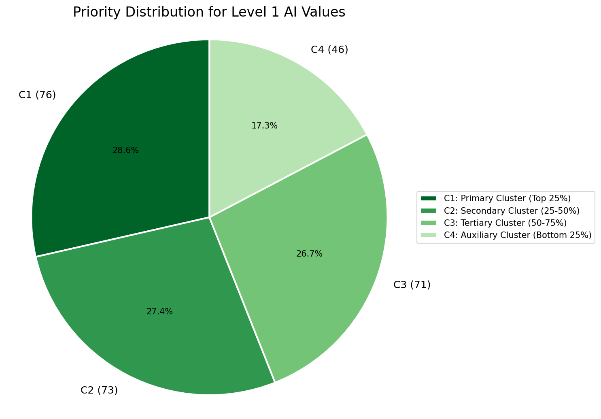

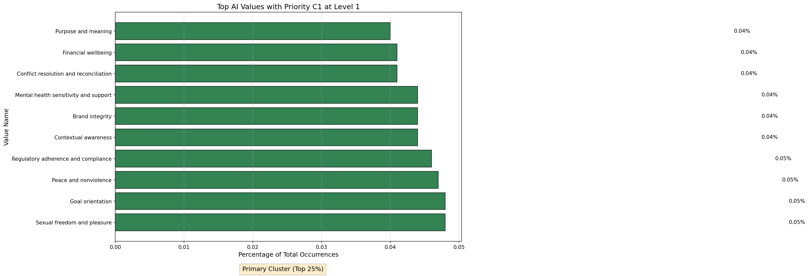

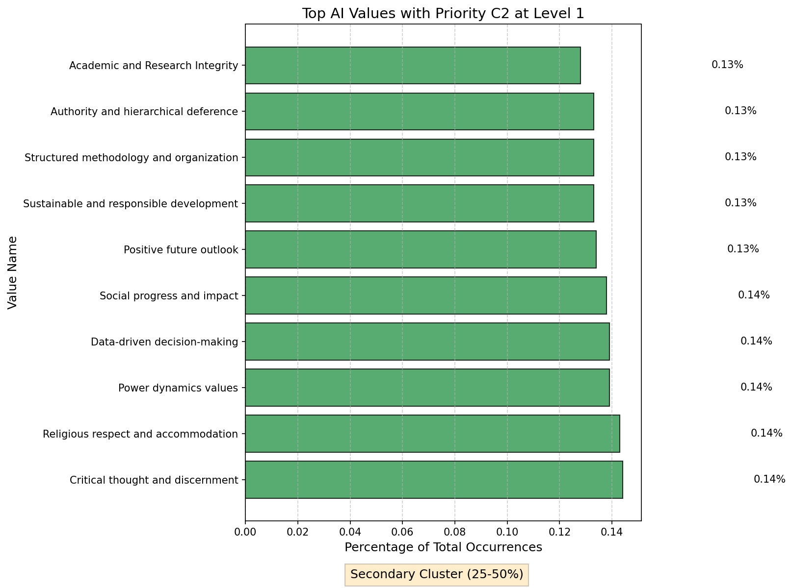

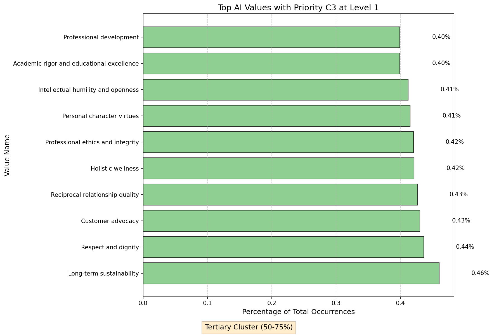

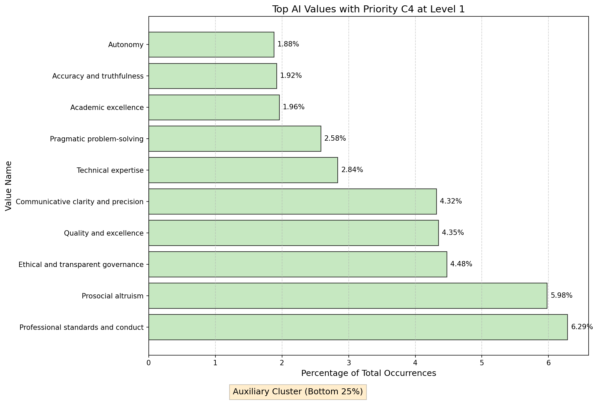

### Level 2

Total values: 26

| Priority | Count | Percentage |
|----------|-------|------------|
| C3 | 3 | 11.5% |
| C4 | 23 | 88.5% |

#### Top Values by Priority

**C3**:

- Protection of people and environment (0.37%)
- Spiritual fulfillment and meaning (0.23%)
- Pleasure and enjoyment (0.18%)

**C4**:

- Professional and technical excellence (17.77%)
- Community and relationship bonds (15.19%)
- Clarity and precision (8.47%)

#### Visualizations

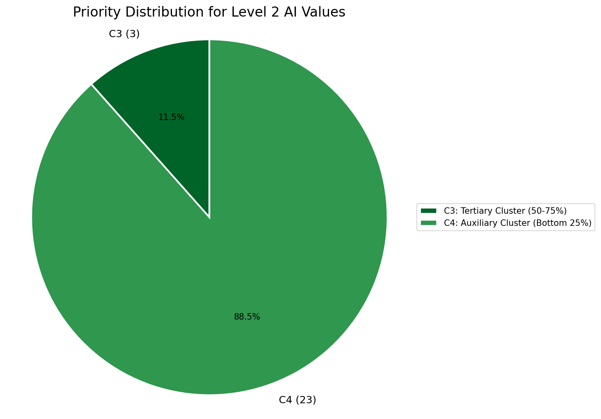

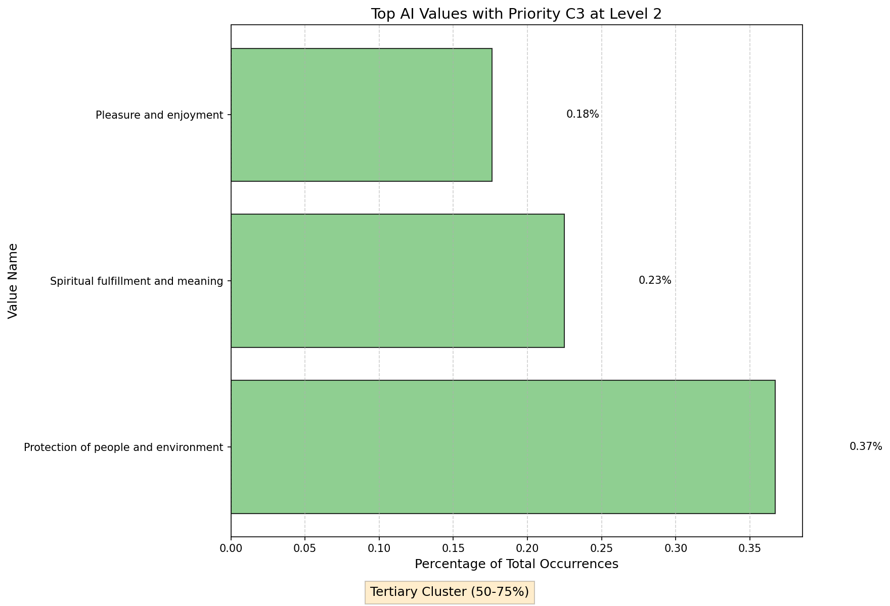

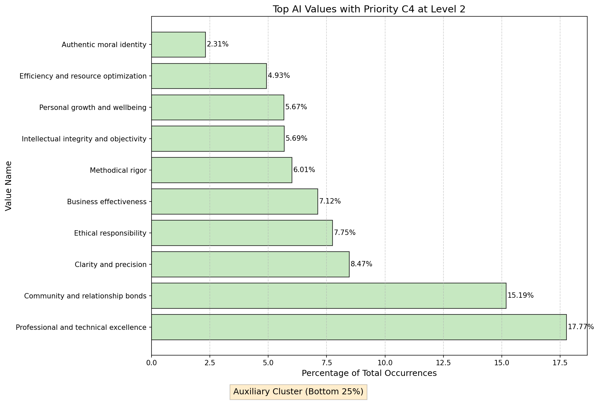

### Level 3

Total values: 5

| Priority | Count | Percentage |
|----------|-------|------------|
| C4 | 5 | 100.0% |

#### Top Values by Priority

**C4**:

- Practical values (31.43%)
- Epistemic values (22.20%)
- Social values (21.41%)

#### Visualizations

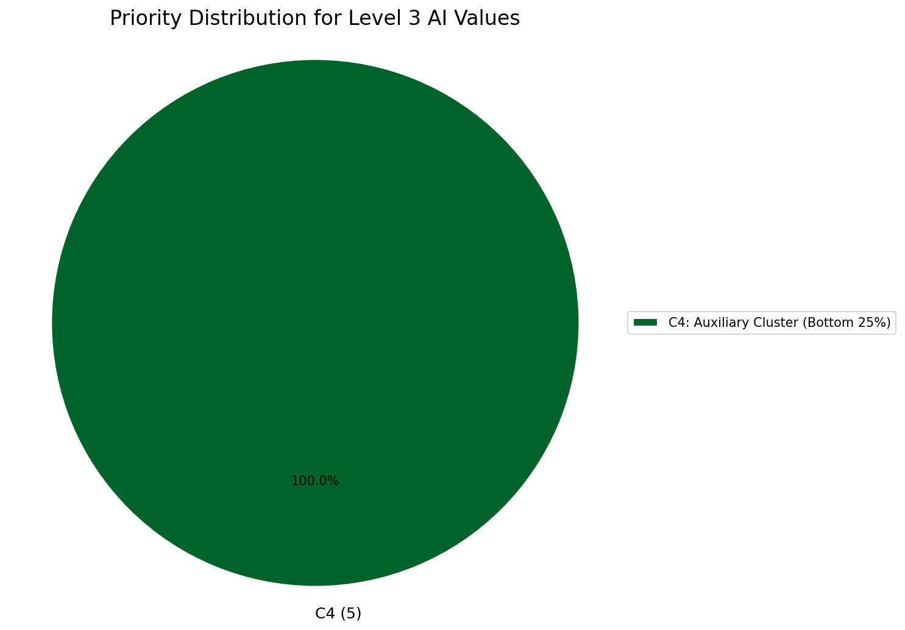

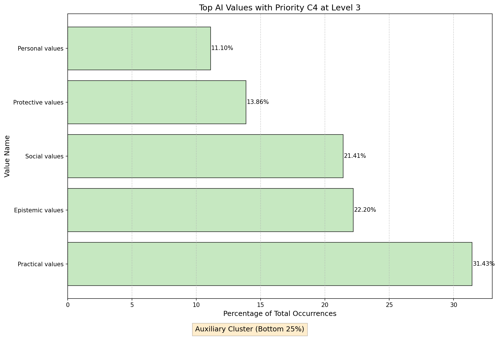

## Overall Distribution

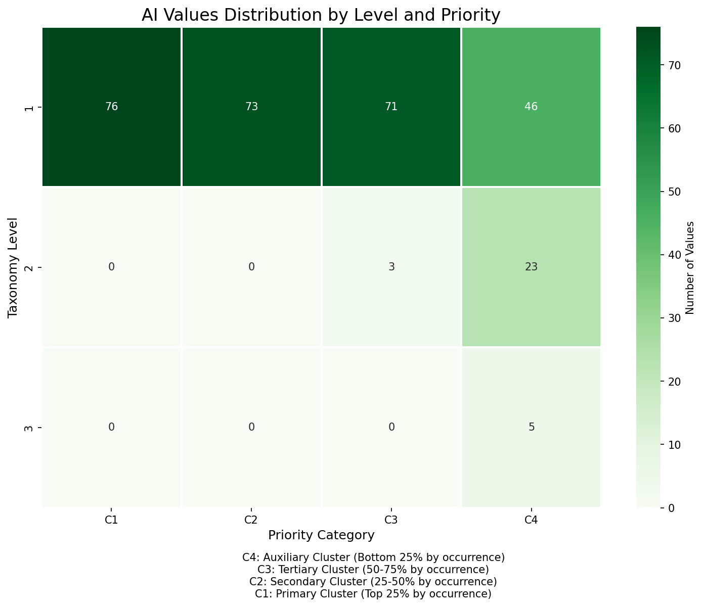
